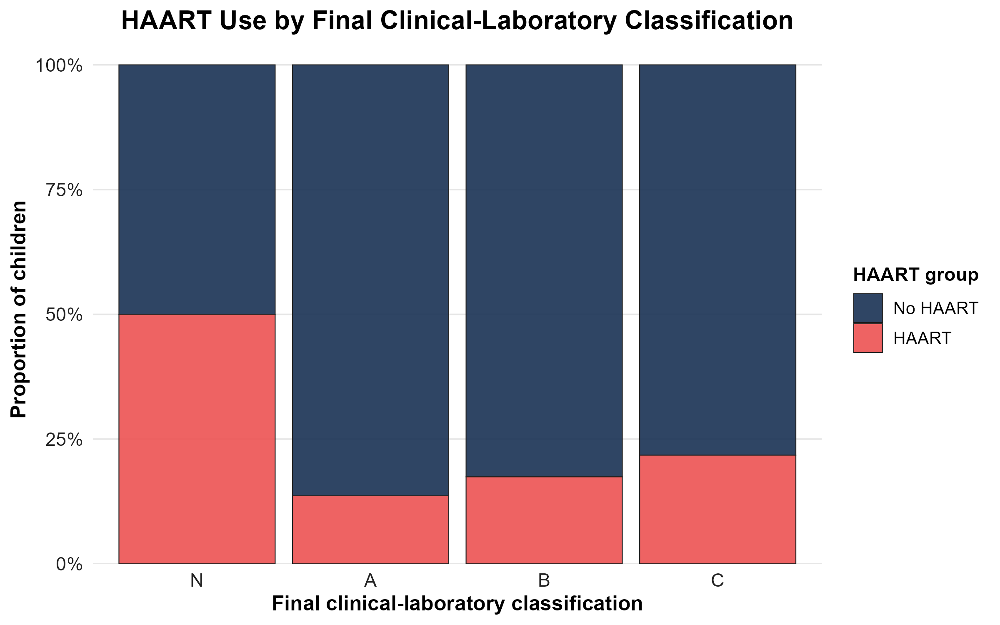
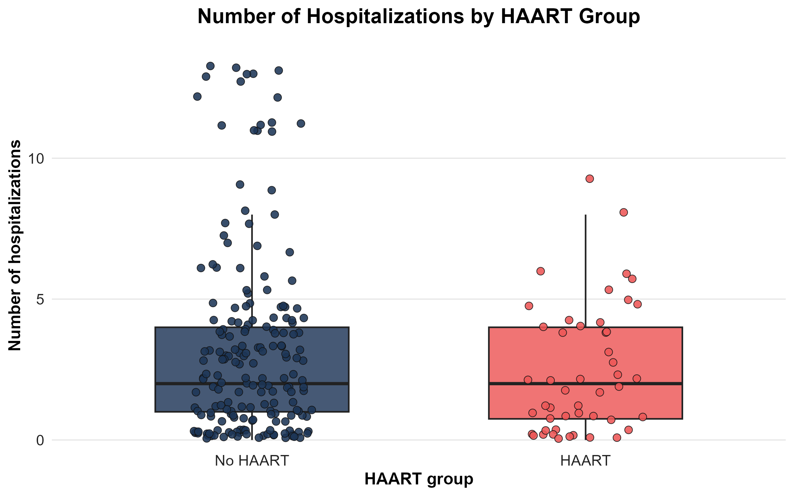

# Pediatric HIV HAART Clinical Data Analysis

This repository contains an ongoing R-based analysis project using a didactic pediatric HIV clinical follow-up dataset. The project compares clinical and laboratory patterns between children who received HAART therapy and those who did not.

The current public version includes data import, data cleaning, descriptive analysis, categorical association testing, and selected visualizations. Additional inferential analyses are still under development.

## Project status

This project is currently in progress.

Completed public stages:

- `01_import_data.R`: imports the original dataset and standardizes column names.
- `02_data_cleaning.R`: prepares selected clinical and categorical variables for analysis.
- `03_descriptive_analysis.R`: generates descriptive summaries and Table 1 outputs.
- `04_statistical_tests.R`: performs categorical association tests between HAART group and selected clinical variables.
- `05_visualizations.R`: generates selected figures for visual inspection and reporting.

Planned or ongoing stages include additional analyses of CD4 counts, viral load trajectories, hospitalization-related variables, and correlation patterns.

## Dataset

This project uses a didactic simulated dataset based on pediatric HIV clinical follow-up. The dataset is used for academic training and portfolio purposes.

Raw and processed data files are not included in the public repository.

## Repository structure

```text
scripts/
  Public analysis scripts.

data/
  raw/          Raw data files, not included publicly.
  processed/    Processed data files, not included publicly.

tables/
  Generated tables, not included publicly by default.

figures/
  Generated local figures, not included publicly by default.

outputs/
  Selected public-facing outputs used for portfolio display.

report/
  Local Quarto reports, not included publicly.
```

Some folders are kept in the project structure but their contents are intentionally ignored by Git. This includes raw data, processed data, generated tables, local figures, full private scripts, study notes, and local reports.

## Current outputs

Selected visualization outputs are provided in `outputs/figures/`. These are curated portfolio outputs copied from the local generated figures after review.

### HAART use by final clinical-laboratory classification



### Number of hospitalizations by HAART group



## Notes on visualization

For hospitalization count plots, individual points are slightly jittered to reduce overplotting caused by repeated discrete count values. Boxplot summaries are computed from the original hospitalization count variable, while jittered point positions are used only for visual display.

## Methods overview

The current public workflow includes:

1. Dataset import and column name standardization.
2. Data cleaning and preparation of selected clinical variables.
3. Descriptive summaries by HAART group.
4. Categorical association testing using Fisher's exact test or Pearson's chi-square test according to expected cell counts.
5. Visualization of selected clinical and therapeutic patterns.

## Tools

- R
- tidyverse
- ggplot2
- gtsummary
- readxl
- readr
- writexl
- here
- Quarto

## Important note

This project is intended for educational and portfolio purposes. The dataset is didactic and simulated; therefore, the analyses should not be interpreted as clinical evidence.